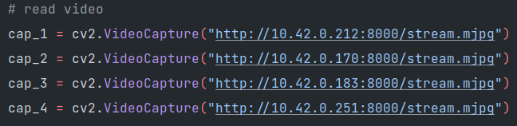
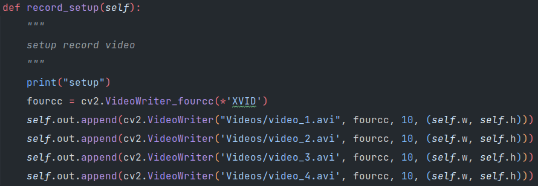

## Readme
>This is repository for collect data birds view using multiple camera.

## How to use?

1. Set up virtual environment
   1. Open using Pycharm
      > If Pycharm show just like this picture please press OK. This is created Virtual Env and install all requirements

      
   
   2. If not show figure above please open **Terminal** on your Pycharm and **Type**: 
      
      ```python
      python3 -m venv venv
      source venv/bin/activate
      pip install -r requirements.txt
      ```
2. Change the source of image
   

3. Run Program!
   > Type this command in your Terminal
   ```python
   python3 main.py
   ```

## Keyboard input
1. Space
   - Save image to images directory
2. R
   - Start to record video
3. S
   - Stop record video

## Save and Record Location
> Image will same in **images** directory:

   

> Video will save in **video** directory

   

Note:
   1. You can change location of image save by yourself
   2. After save please **move** or **change** the name of the file so overwrite no happens
